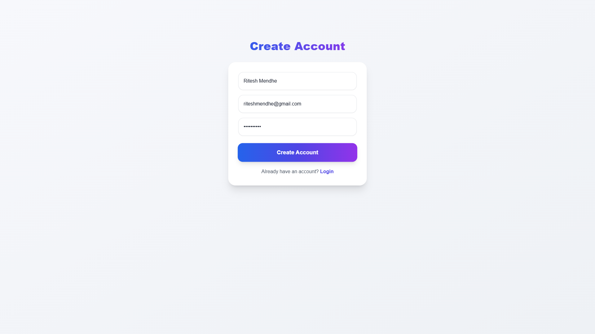
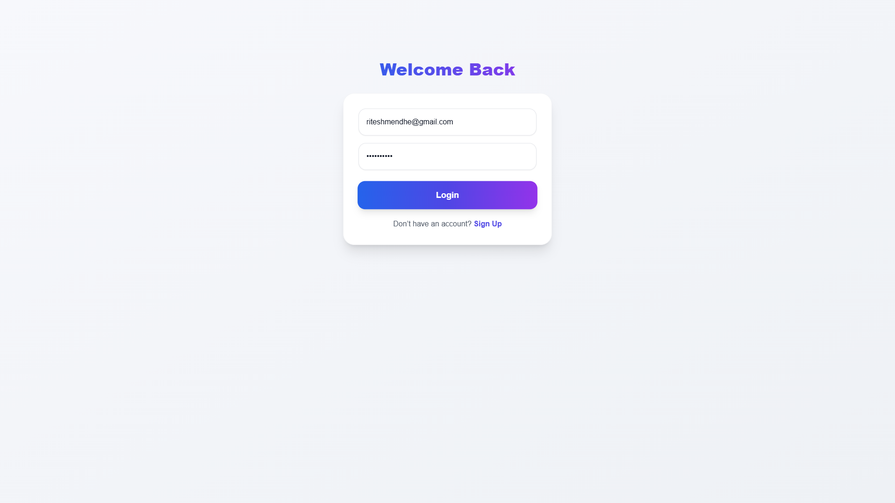
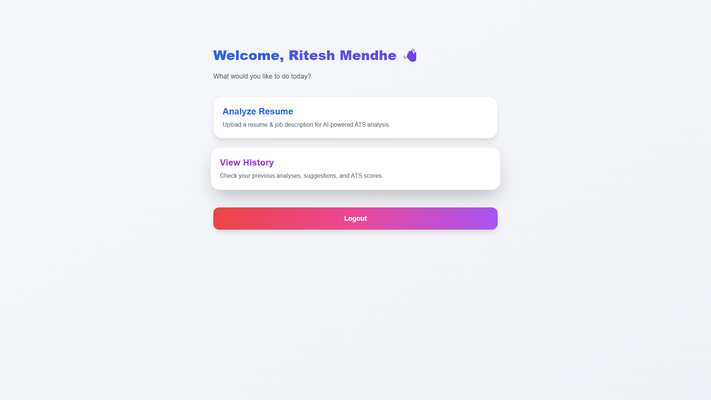
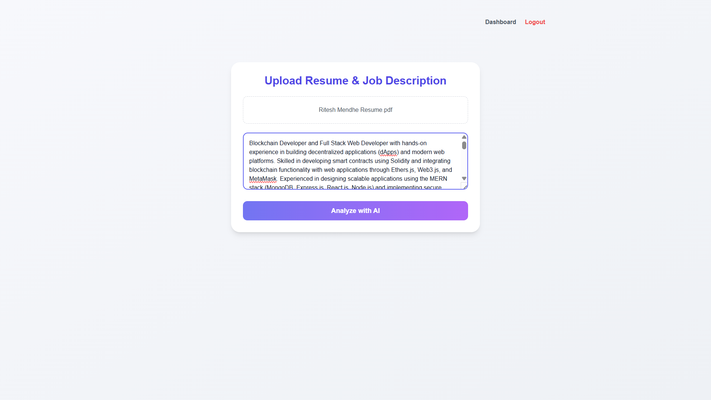
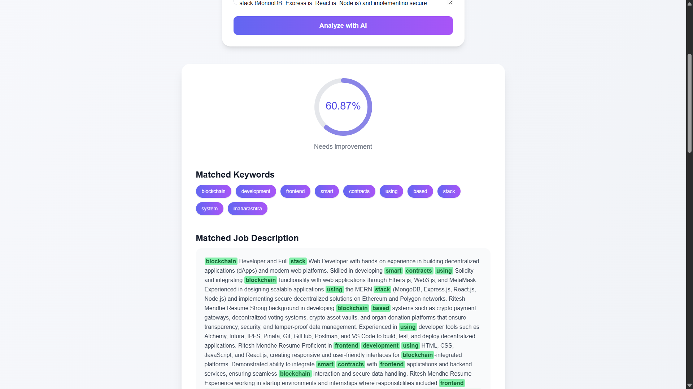
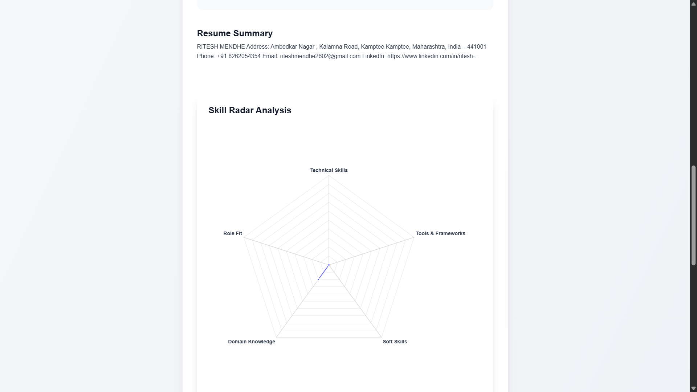
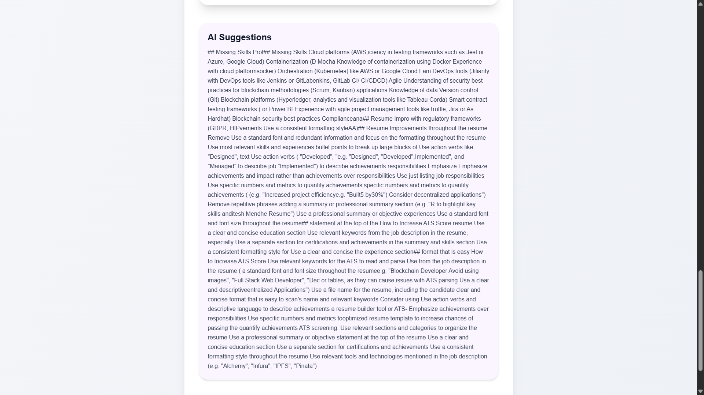
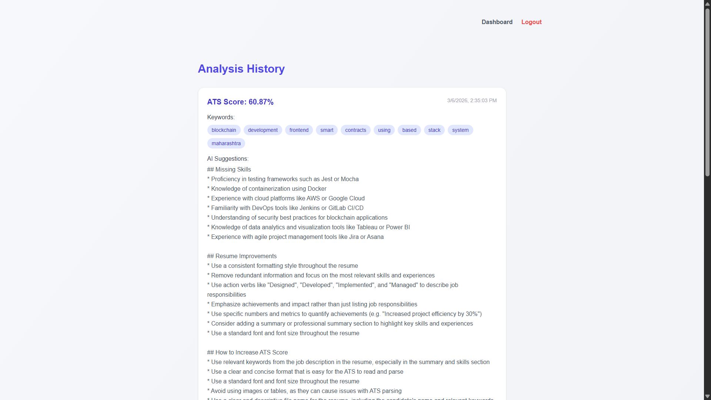

# 🤖 Smart Resume Analyzer
### AI-Powered ATS Resume Analysis & Optimization Platform

Smart Resume Analyzer is an **AI-powered web application** that evaluates resumes against job descriptions to determine **ATS (Applicant Tracking System) compatibility**.

The platform helps job seekers understand how well their resume matches a specific job role by calculating an **ATS score**, identifying **matched keywords**, detecting **missing skills**, and generating **AI-powered improvement suggestions**.

Users can upload their resume, paste a job description, and receive **detailed insights including resume score, keyword matches, skill analysis, and optimization recommendations**.

---

## 🚀 Key Features

### 1️⃣ Secure User Authentication
The system includes a complete authentication flow for secure user access.

- User registration  
- Login system  
- Protected dashboard  
- Logout functionality  

---

### 2️⃣ Resume & Job Description Analysis
Users can upload their resume and paste the job description for ATS evaluation.

- Upload resume files  
- Paste job description text  
- Analyze compatibility between resume and job requirements  

---

### 3️⃣ AI-Powered ATS Score
The system calculates an **ATS compatibility score** showing how well the resume matches the job description.

Example output:

```
ATS Score: 60.87%
Status: Needs Improvement
```

This helps job seekers understand their **chances of passing ATS screening systems** used by recruiters.

---

### 4️⃣ Keyword Matching Engine
The platform identifies important **matching keywords** between the resume and job description.

Example matched keywords:

- blockchain  
- development  
- frontend  
- smart  
- contracts  
- stack  
- system  

These keywords help determine ATS compatibility.

---

### 5️⃣ Job Description Highlighting
Matched keywords are **highlighted directly inside the job description**, making it easy to visually identify which skills match the resume.

---

### 6️⃣ Resume Summary Extraction
The system extracts important information from the uploaded resume including:

- Name  
- Address  
- Phone number  
- Email  
- LinkedIn profile  

This generates a **structured resume summary for analysis**.

---

### 7️⃣ Skill Radar Analysis
A **radar chart visualization** evaluates the candidate profile across different dimensions:

- Technical Skills  
- Tools & Frameworks  
- Soft Skills  
- Domain Knowledge  
- Role Fit  

This helps users visualize their strengths and improvement areas.

---

### 8️⃣ AI Resume Improvement Suggestions

The system provides **AI-generated suggestions** to improve resume quality and ATS compatibility.

#### Missing Skills
- Docker & Containerization  
- Cloud Platforms (AWS, Azure, Google Cloud)  
- DevOps Tools (Jenkins, GitLab CI/CD)  
- Data Visualization (Power BI, Tableau)

#### Resume Improvements
- Use action verbs like *Developed*, *Designed*, *Implemented*  
- Add measurable achievements  
- Improve formatting consistency  
- Remove redundant information  

---

### 9️⃣ Resume Analysis History
Users can view their **previous resume analyses**.

Stored information includes:

- ATS score  
- Matched keywords  
- AI suggestions  
- Analysis timestamp  

---

## 🛠 Tech Stack

### Frontend
- HTML  
- CSS  
- JavaScript  

### Backend
- Python (Flask)

### Database
- MongoDB Atlas

### AI / Analysis
- Natural Language Processing (NLP)  
- Keyword Matching Algorithms  
- AI-generated Resume Suggestions  

---

## 📸 User Interface Preview

### 🔐 User Registration


### 🔑 User Login


### 📊 User Dashboard


### 📄 Resume & Job Description Upload


### 📈 ATS Score & Keyword Matching


### 📊 Skill Radar Analysis


### 🤖 AI Suggestions


### 📜 Analysis History


---

## ⚙️ Project Setup & Installation

### 1️⃣ Clone the Repository

```bash
git clone https://github.com/yourusername/smart-resume-analyzer.git
```

### 2️⃣ Navigate to the Project Directory

```bash
cd smart-resume-analyzer
```

### 3️⃣ Open MongoDB Atlas

1. Login to **MongoDB Atlas**
2. Open your **Cluster**
3. Click **Browse Collections**
4. Ensure your database is active.

---

### 4️⃣ Run the Frontend

```bash
cd frontend
npm start
```

Frontend will run at:

```
http://localhost:3000
```

---

### 5️⃣ Run the Backend

Open another terminal and run:

```bash
cd backend
python app.py
```

Backend will run at:

```
http://localhost:5000
```

---

### 6️⃣ Access the Application

Open your browser and go to:

```
http://localhost:3000
```

Now you can:

- Create account  
- Login  
- Upload resume  
- Paste job description  
- Analyze ATS score  

---

## 🎯 Use Cases

### Job Seekers
Improve resumes to pass ATS screening systems.

### Students
Optimize resumes before applying for internships.

### Recruiters
Quickly evaluate resume compatibility with job roles.

---

## 🔮 Future Improvements

- AI Resume Rewriting  
- LinkedIn Profile Analyzer  
- Resume Template Generator  
- Multi-language Resume Support  
- Advanced NLP Skill Detection  

---

## 👨‍💻 Author

**Ritesh Mendhe**

Blockchain Developer | Full Stack Developer | Web3 Enthusiast  

LinkedIn  
https://www.linkedin.com/in/ritesh-mendhe-209225294  

GitHub  
https://github.com/riteshmendhe2602  

---

⭐ If you like this project, give it a **star on GitHub**.

